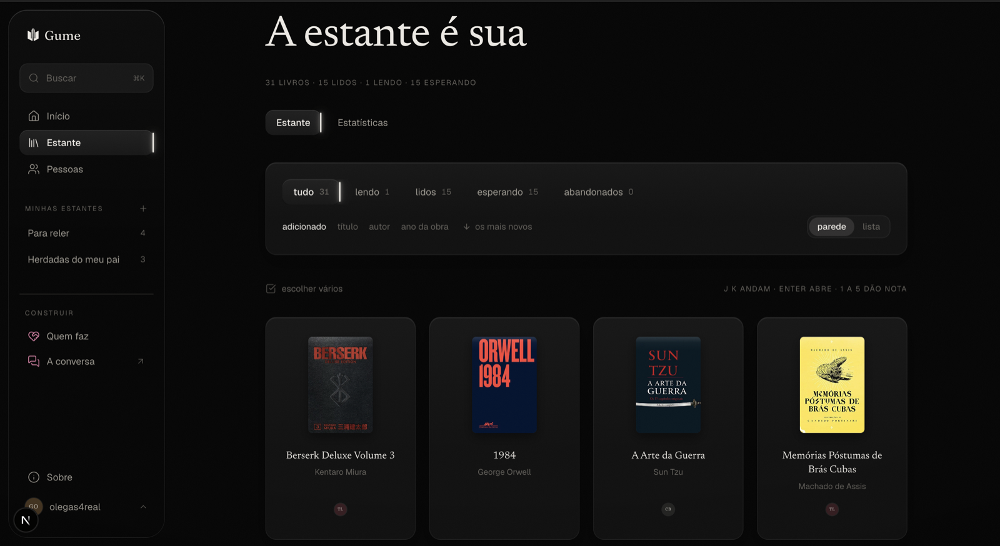
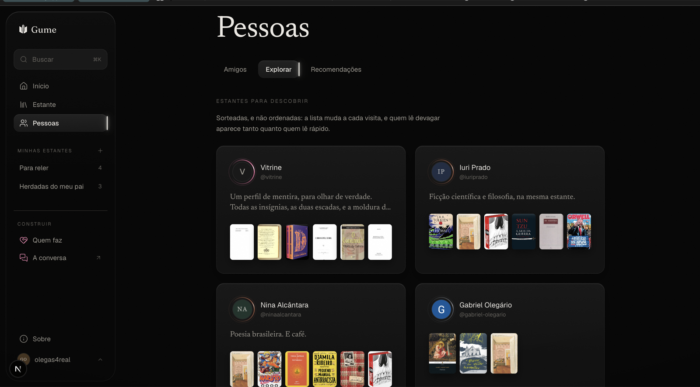
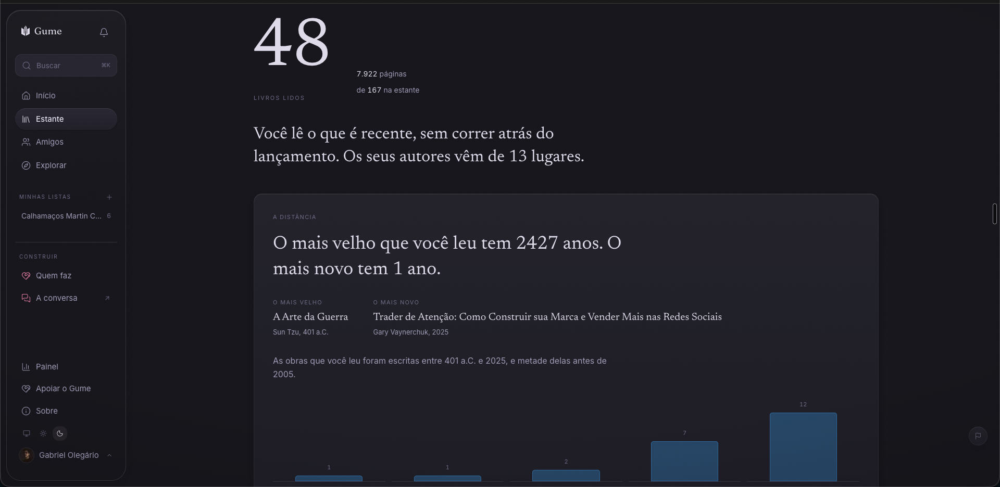
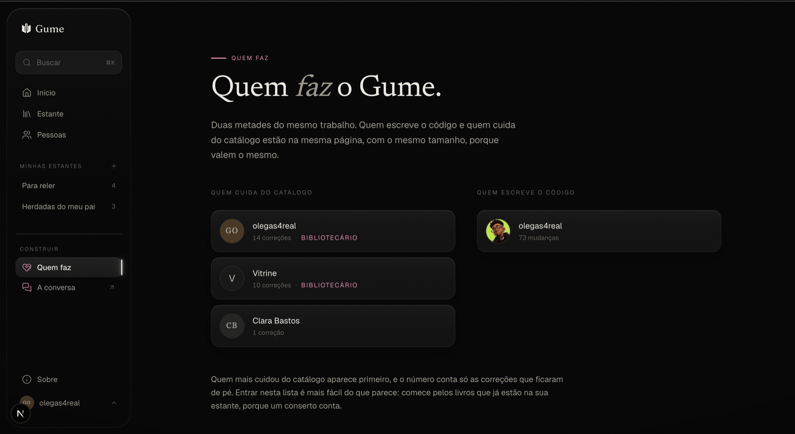
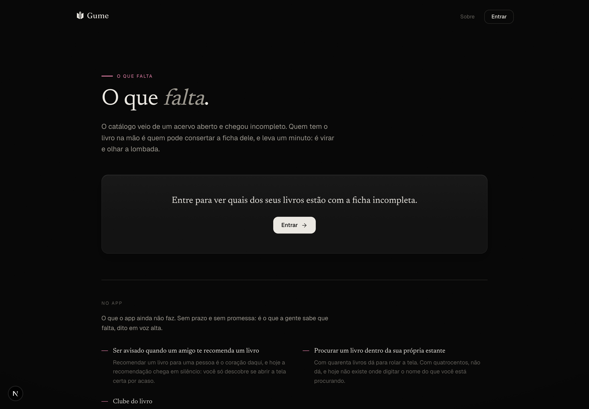
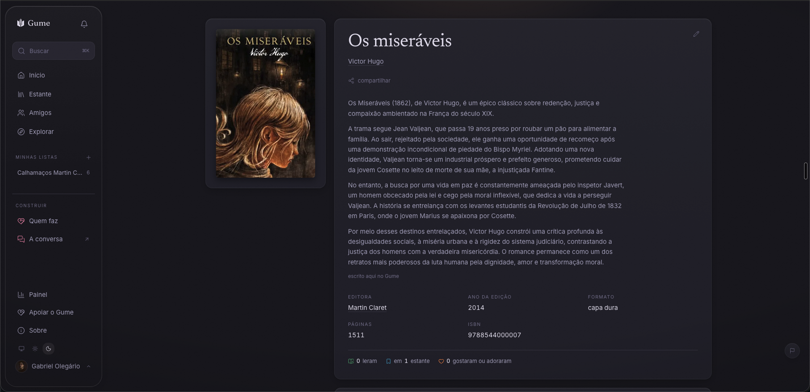

<div align="center">

<picture>
  <source media="(prefers-color-scheme: dark)" srcset="./public/logo/lockup-vertical-branco.png">
  
</picture>

**A mente nunca perde o fio.**

Um registro de leitura aberto, construído com quem lê.

[English](./README.en.md) · [gume.club](https://gume.club) · [Discussões](https://github.com/4-RL-Co/gume-club/discussions) · [Como contribuir](./CONTRIBUTING.md)

[](./LICENSE)
[](https://github.com/4-RL-Co/gume-club/actions/workflows/ci.yml)

Auto-hospedável · Sem anúncios, sem links de afiliado, sem algoritmo

</div>

---


App de leitura se vende pela cara, então esta é a cara. Fundo preto, serifa, e a única cor vem das capas. Sem placar, sem barra de progresso, sem nada em alta.

---

## O nome

Gume é o fio da lâmina. A parte que corta.

A mente nunca perde o fio. Uma lâmina que ninguém amola não enferruja de um dia para o outro: ela vai perdendo o corte, devagar, e continua parecendo uma lâmina. Você só descobre quando ela falha em cortar o que sempre cortou. Com a cabeça é igual.

Por isso a gente lê. Livro é pedra de amolar, e quem passa na pedra não perde o fio: não para colecionar capas, nem para bater meta, e muito menos para ganhar ponto.

Um app de leitura que te dá ofensiva de sete dias entendeu tudo errado sobre o que está acontecendo quando você lê. Aqui não existe ofensiva, não existe meta do ano, e o número nunca cai quando você para de ler.

O que existe é uma **escada**: Ferro, Bronze, Prata, e por aí, pelo que você leu na vida. Ela sobe devagar, ela nunca desce, e ela não tem placar. É um grupo de amigos vendo a própria vida de leitor tomar forma, e não uma corrida.

## Por quê

Já usei quase todos os apps de leitura. Cada um acerta em alguma coisa: um tem uma estante linda, outro tem as melhores estatísticas que já vi, outro tem uma comunidade de verdade em volta. Eu ficava pulando de um para outro e nunca me fixava.

O que eu queria não existia: um app em que quem lê também é quem decide no que ele vai virar. Um lugar onde você abre uma issue sobre aquilo que te incomoda e vê a coisa ser resolvida, ou resolve você mesmo. Um lugar onde a sua biblioteca não é uma moeda de troca que você teria que deixar para trás se um dia quisesse ir embora.

Então: Gume. A parte interessante não é o registro. É o "nós".

## O que é

- **Uma estante.** Quero ler, lendo, lido, abandonado. Releituras. Físico e digital, no mesmo lugar. A nota é uma **palavra** (adorei, gostei, achei ok, não gostei, não terminei), e nunca um número: estrela é escala, escala vira média, média vira placar.
- **Um feed de amigos, e uma galeria para descobrir.** O feed é cronológico e só de quem você segue: o que os seus amigos leram, sem nada injetado no meio. E há o Explorar, uma galeria de curadores: estantes de gente que você ainda não segue e coleções montadas à mão, sorteadas e não ordenadas. Você entra nela quando quer, em vez de ela entrar em você.
- **Coleções, montadas à mão.** Você monta uma coleção com capa, descrição e, se a ordem for o ponto, com 1º, 2º e 3º. A coleção boa de outra pessoa você **guarda**: ela aparece no seu perfil com o crédito de quem fez, e ninguém conta quantos guardaram, porque endosso contado é curtida com outro nome. E existe uma lista que ninguém edita: o **Top 100 dos queridinhos**, os livros que a comunidade mais adorou, refeito a cada veredito. É ranking de livro, e nunca de gente: livro no pódio é curadoria; gente no pódio é a corrida que a gente recusou.
- **Um grafo aberto de livros.** Dados de livros contribuídos por leitores, e a intenção declarada de publicá-los de volta como um dataset aberto, para que, se este projeto um dia acabar, os dados sobrevivam a ele. A parte do leitor corrigir o catálogo já funciona; a publicação do dump é um passo ainda por vir.
- **Arquivos que você pode levar embora.** Um clique, e o arquivo desce: JSON e CSV, com a estante, as datas de leitura, as notas, as resenhas (inclusive as privadas) e as correções que você fez no catálogo. Sem fila, sem e-mail, sem "estamos preparando o seu arquivo", que é atrito disfarçado de cuidado. **E o CSV usa as colunas do export do Goodreads**, que é o formato que o Skoob, o StoryGraph, o Oku e o Fable sabem importar: *uma exportação só é uma saída se outro app conseguir ler*. Um JSON proprietário que ninguém importa é um bilhete de sequestro em fonte bonita. Sair deveria ser fácil. É isso que faz ficar significar alguma coisa.

<table>
<tr>
<td width="50%"></td>
<td width="50%"></td>
</tr>
</table>

## O que não vai ser

Não é um backlog. Escolhas, feitas de propósito, para que todo mundo que constrói aqui esteja construindo a mesma coisa:

- **Sem curtida, sem contador de seguidores, sem ofensiva (streak).** E sem placar: existe uma **honra** no seu perfil, e **não existe lista de quem leu mais**. Uma lista ordenada por leitura é uma máquina de fazer gente mentir que leu.
- **A honra nunca cai, e não olha para o relógio.** Não existe "livros este mês", não existe temporada, e parar de ler por um ano não custa nada. Um app que faz o número descer quando a vida aperta é um app que pune quem está de luto, doente ou com um filho recém-nascido, e faz a pessoa abrir um livro fino de que não gosta só para não perder o que já era dela.
- **Abandonar não pune, e a nota não conta.** Ler e odiar vale o mesmo que ler e adorar; largar um livro ruim não tira nada. Se "adorei" valesse mais, o app estaria comprando elogio. Se abandonar custasse, ninguém mais largaria um livro ruim.
- **Sem feed algorítmico.** As recomendações vêm de pessoas cujo gosto você escolheu seguir.
- **Sem link de afiliado.** Hoje não há link de compra em lugar nenhum do app. Se um dia houver, aponta para livraria independente e para a sua biblioteca, nunca para um afiliado da Amazon.
- **Sem anúncios, e o seu histórico de leitura nunca está à venda.**
- **Sem notificações de engajamento.** A gente te avisa quando um amigo publica. A gente não vai te avisar que a sua estante sente a sua falta.

Se algum desses pontos é um impedimento para você, tudo bem, e existem bons apps que fazem a escolha oposta.



As estatísticas dizem quem você é (a idade das obras que você lê, os países dos autores), e nunca quanto você leu. Comparar gosto é o produto; comparar esforço é o veneno.

## Como isso se paga

O `gume.club` é hospedado e pago pela [4/RL Co.](https://github.com/4-RL-Co). Um dia vai existir um jeito de apoiar o projeto, e ele vai ser opcional e **cosmético**: um selo no perfil, e nada além disso. Apoio não destrava função: quem paga e quem não paga usam exatamente o mesmo Gume. Isso está escrito aqui de propósito, porque é uma promessa.

A licença é a garantia. Se a instância hospedada um dia deixar de honrar a lista acima, você pode pegar o código, pegar os seus dados e rodar por conta própria. A saída é o ponto: é ela que torna as promessas reais, em vez de só bonitas.

## Rodando

Dois comandos, e eles têm que funcionar numa máquina limpa.

```bash
git clone git@github.com:4-RL-Co/gume-club.git
cd gume-club
```

**macOS, sem Docker** (mais leve, e o que o mantenedor usa):

```bash
bash scripts/setup-mac.sh   # homebrew, node, postgres, pnpm, .env, migrations
pnpm dev                    # http://localhost:3000
```

**Com Docker**, em qualquer lugar:

```bash
cp .env.example .env
docker compose up -d
pnpm install && pnpm db:migrate && pnpm dev
```

Quer uma estante de exemplo para não começar com o app vazio? `pnpm db:seed:exemplo`.

Se qualquer um dos dois falhar numa máquina limpa, isso é um bug e a gente quer a issue. Código aberto que você não consegue rodar é decoração.

## Como contribuir

Essa é a parte que importa. O Gume existe para ser construído por quem usa.

**E dá para contribuir sem escrever uma linha de código.** O catálogo é de todo mundo:
consertar uma capa errada, preencher um ano que falta, apontar uma edição trocada: tudo isso
é contribuição, aplicada na hora, com o seu nome no histórico. Na página de quem faz o Gume,
quem cuida do catálogo e quem escreve o código aparecem lado a lado, com o mesmo peso, porque
**um conserto de capa vale o que vale um commit.**

<table>
<tr>
<td width="50%"></td>
<td width="50%"></td>
</tr>
</table>

Para quem vai escrever código, especialmente bem-vindos:

- **Importadores.** StoryGraph, Skoob, LibraryThing, Kindle, Kobo. O de Goodreads já existe e abriu a espinha; estes reusam. A régua é **sem perdas**: datas de leitura, notas, texto de resenha, prateleiras, tudo. Migrações pela metade são o motivo de a maioria das pessoas nunca sair de uma plataforma que já superaram. Cada importador é um primeiro PR autocontido.
- **Dados de livros.** Casamento (matching), deduplicação, capas, catálogos fora do inglês.
- **PT-BR redondo.** A prioridade é o app impecável em português do Brasil. Traduzir para outros idiomas fica para muito depois, quando o BR estiver sólido. Não é a hora.
- **Design.** A régua está em [docs/design.md](./docs/design.md). Se você conseguir superá-la, por favor supere.

As issues marcadas com `good first issue` são de verdade: cada uma diz o que é, por que importa, qual arquivo mexer, e como testar. As maiores já têm o texto inteiro pronto em [`.github/ISSUE_DRAFTS/`](./.github/ISSUE_DRAFTS). Leia o [CONTRIBUTING.md](./CONTRIBUTING.md) e o [Código de Conduta](./CODE_OF_CONDUCT.md) antes. E **você pode perguntar antes de começar**, nas [Discussões](https://github.com/4-RL-Co/gume-club/discussions).

## O catálogo é comum, e é a parte difícil

Todo o resto num registro de leitura é simples. Os metadados de livros são onde esses projetos vivem ou morrem.



O modelo:

- Uma **obra** é o livro como ideia. *Dom Casmurro*.
- Uma **edição** é um objeto. A capa dura da Clube de Literatura Clássica, com aquela capa, o ISBN, a contagem de páginas.
- Você avalia a **obra**. Você lê uma **edição**, porque a contagem de páginas muda.
- Cada correção é uma **revisão append-only** com um autor. Nada é sobrescrito em silêncio, qualquer coisa pode ser revertida, e a confiança se conquista com o tempo. A capa é a única exceção: como é o único campo que aparece na tela de todo mundo, ali o leitor propõe e um bibliotecário confere.

**Capa diferente é EDIÇÃO diferente.** Sobrescrever a ficha compartilhada para ela bater com a sua cópia é proibido, e foi assim que o catálogo do Goodreads virou lixo. Se você tem opiniões sobre isso, a gente quer ouvir.

## Status

**Funciona.** O produto está de pé e é usado todo dia por quem o mantém: estante, busca sobre um catálogo em português de centenas de milhares de edições, feed cronológico, recomendação de pessoa para pessoa (com o rosto de quem indicou na capa), coleções com ordem e capa, o Top 100 da comunidade, estatísticas de curadoria, correções do catálogo, convite com procedência, importação e exportação sem perdas.

**Está no ar em [gume.club](https://gume.club).** A instância oficial roda no [Railway](https://railway.app) (o app Next.js e o Postgres, na mesma rede privada), com [Vercel Blob](https://vercel.com/storage/blob) para as imagens que o leitor sobe. Nada disso é obrigatório: sendo auto-hospedável, você roda a sua com um Postgres e um lugar qualquer para as imagens.

O schema, o plano e o sistema de design são públicos de propósito, porque são as decisões caras de mudar depois e baratas de discutir agora. Se você acha que uma delas está errada, abra uma issue. Isso não é formalidade.

**O que segura a qualidade, já que o mantenedor não é programador de formação:** o repositório se defende sozinho. Mais de 850 testes, e os mais importantes não testam funções: eles **varrem o próprio código** e quebram o build se uma regra for violada. Um teste impede um número de contribuição de vazar para fora da página de contribuidores. Outro impede uma insígnia de ser ganha por ler. Outro impede uma rota de nascer pública sem ninguém decidir. E um "red team" ataca o próprio sistema, trocando UUIDs para tentar ler e escrever nas linhas de outra pessoa.

## Stack

| Camada | Escolha | Por quê |
|---|---|---|
| Web | Next.js (App Router) + TypeScript | A web é a plataforma principal, e é o maior público de contribuidores. |
| Estilo | Tailwind + tokens próprios | Ver [docs/design.md](./docs/design.md). |
| Banco | Postgres + Drizzle | Postgres puro, sem recursos específicos de fornecedor, para que a auto-hospedagem seja real. |
| Auth | Better Auth | Auto-hospedável, sem dependência de terceiros. |
| Dados de livros | [Open Library](https://openlibrary.org/developers/api) primária, Google Books como fallback | Licença aberta, sem chave. Mantemos as nossas próprias tabelas `works`/`editions` para que leitores possam corrigir dados ruins. |
| Mobile | PWA primeiro, nativo depois | Instalável desde o primeiro dia. |
| Construído com | [Claude Code](https://claude.com/claude-code), da Anthropic | O código é escrito em par com IA, e o repositório não esconde isso. A régua é humana: o que segura a qualidade são os testes que varrem o próprio código, e uma pessoa decide o que entra. |

## Onde as coisas estão

| Pasta | O que é |
|---|---|
| `app/` | As telas (Next.js App Router) e as ações de servidor |
| `components/` | As peças de interface |
| `lib/` | Toda a lógica de servidor. **`lib/authz.ts` é a autorização, e ela mora só ali.** |
| `lib/db/` | O schema (Drizzle) e as migrations |
| `scripts/` | Import do catálogo, seeds, auditoria de segurança |
| `docs/` | [Schema](./docs/schema.md), [sistema de design](./docs/design.md), a [regra de nomes proposta](./docs/NOMES.md), telas |
| `ai/` | [Plano](./ai/PLAN.md), [PRD](./ai/PRD.md), e o [registro de decisões](./ai/DECISIONS.md) |

**Leia primeiro:** [AGENTS.md](./AGENTS.md) é o contrato deste repositório: as regras, o que não se vibe-coda, e como o código entra no `main`. [ai/DECISIONS.md](./ai/DECISIONS.md) é a memória: começa com as dez regras que valem hoje, e cada decisão dura está lá com o **porquê**, e não se relitiga sem argumento novo.

## Licença

[AGPL-3.0](./LICENSE). Rode, altere, hospede para outras pessoas. Se você hospedar uma versão modificada, compartilhe as mudanças. Ninguém pode fechar isto e vender o seu histórico de leitura de volta para você.
